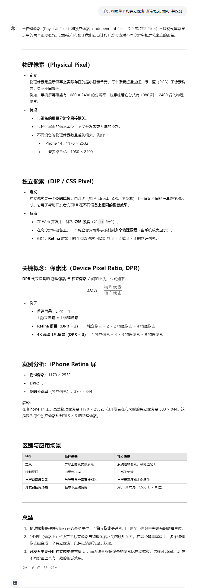

# React + react-router + zustand + TypeScript + Vite

### 任务列表

- [x] 状态管理
    - [资料](https://awesomedevin.github.io/zustand-vue/docs/introduce/start/zustand)
- [x] 移动端适配设置
    - [资料](https://blog.csdn.net/weixin_57677300/article/details/129164050)
    - 
- [] 网络封装(https://github.com/zkp442910864/common-utils.git)
- [] 提取成类库(https://github.com/zkp442910864/common-utils.git)
- [x] unocss
    - [资料](https://unocss.dev/integrations/vite)
- [x] gzip，分析依赖
    - [分析依赖-资料](https://www.mulingyuer.com/archives/1033/)
    - [gzip-资料1](https://github.com/nonzzz/vite-plugin-compression)
    - [gzip-资料2](https://github.com/KusStar/vite-bundle-visualizer)
- [] 前端监控 sourceMap提取
    - 抽取sourceMap文件
    - dist, sourceMap 上传服务器
    - 运营后台查看错误信息，选择错误信息对应的 sourceMap 定位错误
    - 提取sourceMap插件，上传资源插件，查看数据页面
    - 考虑怎么实现成sdk
- [x] 页面更新，刷新(https://github.com/zkp442910864/common-utils.git)
- [] react 组件错误处理
